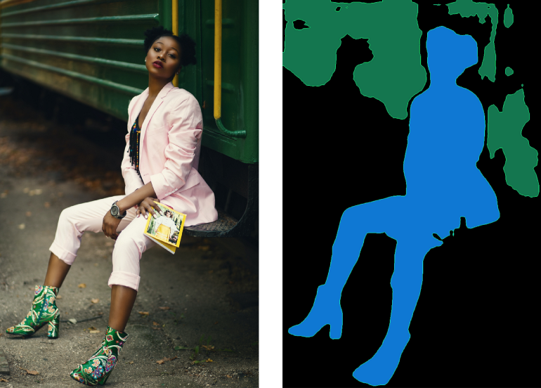

# Build a Django API that performs background customization using semantic segmentation

## Requirements

- Pytorch Cuda capable version, Torchvision
- Opencv
- Numpy
- Pillow

## Test the API with postman

- install [postam](https://www.postman.com/), start requesting on port 8000 with the following url: `http://localhost:8000/api/grayscale/` or `http://localhost:8000/api/inference/`
- provide two images (one for background and the other for foreground) for the `POST` method.
- ENJOY!! :blush:

## Medium article to follow along

- Medium tutorial for an indepth review of the application: [medium post](https://towardsdatascience.com/semantic-segmentation-using-a-django-api-deeplabv3-7b7904ddfed9)

## Contact me

### Aymane Hachcham

- **email**: aymanehachchaming@gmail.com
- **Linkedin**: [linkedin](https://www.linkedin.com/in/aymane-hachcham/)
- **other repos**: [github-repos](https://github.com/aymanehachcham?tab=repositories)
